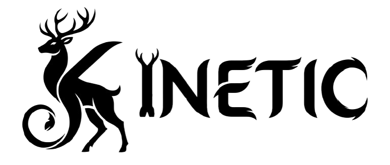

<p align="center">
  <picture>
    <source media="(prefers-color-scheme: dark)" srcset="assets/logo-dark-mode.png">
    <source media="(prefers-color-scheme: light)" srcset="assets/logo-light-mode.png">
    
  </picture>
</p>

<p align="center">
  <a href="https://github.com/Trxncoo/kinetic/actions/workflows/ci.yml"></a>
  <a href="https://pkg.go.dev/github.com/Trxncoo/kinetic"></a>
  <a href="go.mod"></a>
  <a href="LICENSE"></a>
</p>

<p align="center">
  <strong>Small, composable Go packages — built for performance and DX.</strong>
</p>

---

## Packages

- [`kevent`](pkg/kevent) — a generic in-memory event bus (`Bus[T]`,
  `Registry`).

## Install

```sh
go get github.com/Trxncoo/kinetic
```

## Showcase

### kevent

#### Bus

```go
orders := kevent.NewBus[OrderPlaced]()

unsubscribe := orders.Subscribe(func(ctx context.Context, e OrderPlaced) error {
	fmt.Println("emailing receipt for", e.ID)
	return nil
})

orders.Publish(ctx, OrderPlaced{ID: "o1", Total: 42})
unsubscribe()
```

#### Registry

```go
reg := kevent.NewRegistry()

// Wired once at startup, per event type.
kevent.Register(reg, kevent.NewBus[OrderPlaced]())
kevent.Register(reg, kevent.NewBus[UserSignedUp]())

// Elsewhere, code that only knows the event type gets the right bus.
orders := kevent.From[OrderPlaced](reg)
orders.Subscribe(func(ctx context.Context, e OrderPlaced) error {
	fmt.Println("emailing receipt for", e.ID)
	return nil
})
orders.Publish(ctx, OrderPlaced{ID: "o4", Total: 7})
```

See [`pkg/kevent`](pkg/kevent) for the full package docs and runnable
examples.

## License

[MIT](LICENSE)
